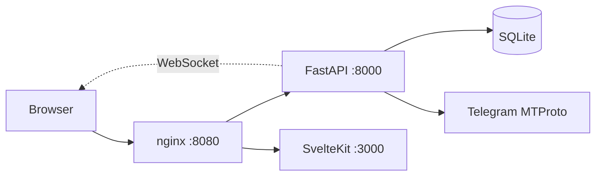

# telesoft

Платформа для управления Telegram-каналами через бота-админа.

## Описание

telesoft — инструмент для управления Telegram-каналами через бота-админа. На данный момент реализована одна фича — массовая замена ссылок в постах канала с сохранением форматирования: пользователь входит в админ-панель, выбирает канал, настраивает шаблон замены и запускает задачу. Бот-админ редактирует посты в фоне, прогресс транслируется в UI в реальном времени через WebSocket.

**Workflow:**

1. Вход в админ-панель (логин/пароль)
2. Выбор канала из списка
3. Настройка замены — один из 3 режимов
4. Превью — показывает before → after для первых 3 совпадений
5. Подтверждение — пользователь проверяет превью и нажимает «Запустить»
6. Запуск — бот редактирует посты в фоне
7. Realtime-прогресс — WebSocket стримит статус каждого поста

**3 режима замены:**

| Режим | Описание | Пример |
|-------|----------|--------|
| **Simple** | Wildcard `*` разворачивается в `.*`, остальное экранируется через `re.escape` | `https://t.me/bot?start=flow-*` → `https://t\.me/bot\?start=flow-.*` |
| **Library** | Готовые паттерны из библиотеки (4 встроенных + кастомные) | `https://t\.me/\w+\?start=\S+` |
| **Advanced** | Raw regex — пользователь пишет регулярное выражение сам | `https://t\.me/(\w+)\?(start=\S+)` |

**Сохранение форматирования:** при замене текста в посте_entities (bold, italic, ссылки) пересчитываются с учётом UTF-16 code units (для emoji и суррогатных пар). URL внутри `MessageEntityTextUrl` (форматированные ссылки) заменяются отдельно через `formatting_entities`.

**Чекбокс «Включить превью ссылки»** (default off) — подавляет preview card в Telegram при редактировании поста. Передаётся в `edit_message(link_preview=...)`.

## Архитектура



**3 контейнера** (Docker Compose):

- **api** — FastAPI backend (python:3.13-slim), порт 8000 внутри сети, healthcheck `/health`
- **web** — SvelteKit frontend (node:22-slim, adapter-node), порт 3000 внутри сети
- **nginx** — reverse proxy (nginx:alpine), единственный внешний порт **8080**, проксирует `/api/` → api, `/` → web, WebSocket upgrade для `/api/ws`

**WebSocket** используется для realtime-прогресса задач: EventBus (pub/sub) → WS-endpoint → браузер. Каждая страница деталей задачи открывает свой WS-коннект.

## Возможности

- **Управление каналами**: список, добавление, редактирование, удаление, активация/деактивация (архивирование)
- **Замена ссылок**: массовая замена ссылок в постах канала с сохранением форматирования (3 режима — Simple, Library, Advanced)
- **3 режима замены**: Simple (wildcard `*` → `.*` + `re.escape`), Library (готовые паттерны), Advanced (raw regex)
- **Pattern library**: 4 встроенных паттерна + кастомные (CRUD). Built-in нельзя удалить (HTTP 403)
- **Preview-confirm-run**: кнопка «Запустить» → превью (before → after для 3 постов) → подтверждение → запуск
- **Чекбокс «Включить превью ссылки»** (default off) — подавляет preview card в Telegram
- **Полная / частичная замена** (`full_replace`): полная добавляет `\S*` к паттерну (замещает весь URL), частичная оставляет pattern as-is (замещает только совпавший префикс)
- **Сохранение форматирования**: bold/italic/links entities пересчитываются при изменении длины текста (UTF-16 code units для emoji)
- **Entity URLs**: замена URL в formatted links (`MessageEntityTextUrl`) через `formatting_entities`
- **Задачи**: список с пагинацией (по 20), фильтр по статусу, авто-обновление (polling 5s), детальная страница с WebSocket realtime-прогрессом
- **Mobile responsive**: dual-layout table ↔ card, sticky top nav на всех устройствах

## Стек

- **Backend**: Python 3.12+, FastAPI, aiosqlite (SQLite), Telethon (bot mode), Pydantic v2, itsdangerous (session cookies), loguru, uv
- **Frontend**: SvelteKit 2, Svelte 5 runes, TypeScript, TailwindCSS, Biome, Vitest, Knip, Playwright
- **Tooling**: ruff, mypy strict, pytest-asyncio, pre-commit, Docker Compose, GitHub Actions

## Требования

- Python 3.12+ и [uv](https://docs.astral.sh/uv/) (для локальной разработки backend)
- Node.js 20+ и npm (для локальной разработки frontend)
- Docker и Docker Compose (для контейнерного запуска)
- Telegram-бот: `TELEGRAM_API_ID`, `TELEGRAM_API_HASH`, `TELEGRAM_BOT_TOKEN` (см. [Настройка бота](#настройка-бота))
- `ADMIN_PASSWORD` и `SECRET_KEY` (32+ символа) для логина админа и подписи session cookie

## Быстрый старт (Docker)

```bash
cp .env.example .env  # заполнить TELEGRAM_API_ID, TELEGRAM_API_HASH, TELEGRAM_BOT_TOKEN,
                      # ADMIN_USERNAME, ADMIN_PASSWORD, SECRET_KEY (32+ символа)
docker compose up --build -d
```

Открыть `http://localhost:8080`. Логин: `ADMIN_USERNAME` / `ADMIN_PASSWORD` (default `admin` / `changeme`).

nginx — единственный открытый порт (8080). api (8000) и web (3000) доступны только внутри Docker-сети. Healthcheck api: `GET /health`.

## Локальная разработка

**Backend** (порт 8000):

```bash
uv sync --extra dev
uv run uvicorn telesoft.main:app --reload  # http://localhost:8000
```

**Frontend** (порт 5173, Vite проксирует `/api` → `:8000`):

```bash
cd web
npm ci
npm run dev  # http://localhost:5173
```

## Переменные окружения

Все переменные читаются `Settings.from_env()` в `src/telesoft/config.py`. Скопируйте `.env.example` в `.env` и заполните значения.

| Имя | Default | Описание |
|-----|---------|----------|
| `ADMIN_USERNAME` | `admin` | Логин админа |
| `ADMIN_PASSWORD` | `changeme` | Пароль админа |
| `SECRET_KEY` | `""` | Ключ подписи session cookie, **32+ символа** (обязательно для production) |
| `HOST` | `0.0.0.0` | Bind host для uvicorn |
| `PORT` | `8000` | Bind port для uvicorn |
| `LOG_LEVEL` | `INFO` | Уровень loguru |
| `DB_PATH` | `app_data/telesoft.db` | Путь к SQLite-базе |
| `TELEGRAM_API_ID` | `0` | Telegram API id с my.telegram.org |
| `TELEGRAM_API_HASH` | `""` | Telegram API hash с my.telegram.org |
| `TELEGRAM_BOT_TOKEN` | `""` | Токен бота от @BotFather |
| `TELEGRAM_SESSION_STRING` | `""` | StringSession auth string — предотвращает FloodWait при restart (см. [Настройка бота](#настройка-бота)) |
| `SESSION_PATH` | `app_data/bot.session` | Путь к файлу сессии Telethon (legacy, не используется при `TELEGRAM_SESSION_STRING`) |
| `JOBS_MAX_CONCURRENCY` | `3` | Максимум одновременных edit-операций в runner |
| `TELEGRAM_REQUEST_DELAY` | `1.0` | Задержка между API-запросами к Telegram (сек) |
| `TELEGRAM_EDIT_DELAY` | `5.0` | Задержка между edit-операциями постов (сек) |

## Настройка бота

1. **Создать бота** через [@BotFather](https://t.me/BotFather) → `/newbot` → скопировать токен → `TELEGRAM_BOT_TOKEN`
2. **Получить API credentials** на [my.telegram.org](https://my.telegram.org) → "API development tools" → `TELEGRAM_API_ID` / `TELEGRAM_API_HASH`
3. **Добавить бота админом** в целевой канал с правом **«Edit Messages»** (опционально «Post Messages» для smoke/spike-скриптов)
4. **`TELEGRAM_SESSION_STRING`** — генерируется один раз, переиспользует `auth_key` между restarts:

   ```python
   python -c "from telethon.sessions import StringSession; print(StringSession.save('app_data/bot.session'))"
   ```

   **Зачем нужен:** без `TELEGRAM_SESSION_STRING` каждый restart бота заново логинится через MTProto → Telegram может выдать `FloodWaitError` (слишком частые auth-запросы). StringSession кэширует `auth_key` в строке → повторный логин не нужен.

5. **Ограничение ботов:** Telegram-боты **не могут листать историю канала** (`get_messages(limit=...)` / `iter_messages` → `BotMethodInvalidError`). Поэтому пользователь даёт ссылку на последний пост (`post_link`) + количество (`limit`) — telesoft fetching последние `limit` постов начиная с `post_link` по message id.

## Тестирование

```bash
# Backend unit (~232 теста, coverage gate 80%)
uv run pytest

# Backend integration (4 теста, opt-in, нужны Telegram креды + тестовый канал)
uv run pytest -m integration

# Frontend unit (~43 теста, Vitest + jsdom)
cd web && npm run test

# Frontend E2E (7 mobile тестов, Playwright, нужен running docker stack)
cd web && npm run test:e2e:mobile
```

Integration-тесты (`tests/integration/test_real_edit.py`) помечены `@pytest.mark.integration` и не запускаются в обычном `pytest`. Требуют `TELEGRAM_*` креды + реальный тестовый канал в `.env`.

## Структура проекта

```
telesoft/
├── src/telesoft/                  # Backend (FastAPI)
│   ├── main.py                    # App entrypoint, lifespan, routers
│   ├── config.py                  # Settings.from_env()
│   ├── core/
│   │   ├── telegram.py            # Telethon bot-mode client (get_message, edit_message, get_last_messages)
│   │   ├── url_parser.py          # parse_post_url / parse_post_link
│   │   ├── pattern_compiler.py    # compile_simple / compile_pattern (3 режима + full_replace)
│   │   ├── link_replacer.py       # replace_link + _adjust_entity_offsets + preview_replace
│   │   ├── events.py              # EventBus pub/sub
│   │   └── runner.py              # JobRunner (asyncio.Semaphore, cooperative cancel)
│   ├── db/
│   │   ├── base.py                # fetchone / fetchall / insert helpers
│   │   ├── connection.py          # init_db / close_db / get_db (singleton)
│   │   └── models/
│   │       ├── channel.py         # channels CRUD
│   │       ├── job.py              # edit_jobs CRUD + count_jobs
│   │       ├── log.py              # edit_logs CRUD + count_logs
│   │       └── pattern.py         # link_patterns CRUD + seed_builtin_patterns
│   ├── api/
│   │   ├── auth.py                # verify_credentials, login, require_auth, ws_current_user
│   │   └── routers/
│   │       ├── auth.py             # POST /api/auth/login, POST /api/auth/logout, GET /api/auth/me
│   │       ├── channels.py         # /api/channels CRUD
│   │       ├── jobs.py             # /api/channels/{id}/replace-link, preview, list, cancel
│   │       ├── patterns.py         # /api/patterns CRUD (built-in delete → 403)
│   │       └── ws.py               # /api/ws WebSocket endpoint
│   └── schemas/                   # Pydantic request/response models
│       ├── auth.py
│       ├── channel.py
│       └── job.py                  # ReplaceLinkRequest, PreviewRequest, PatternCreate, link_preview
├── tests/                         # Backend unit tests
├── tests/integration/             # Backend integration tests (opt-in, -m integration)
├── web/                           # SvelteKit frontend
│   ├── src/
│   │   ├── lib/
│   │   │   ├── api.ts              # fetch wrapper (credentials, 401 redirect)
│   │   │   ├── ws.ts               # WebSocket client (auto-reconnect, heartbeat)
│   │   │   ├── types.ts            # TS types mirroring backend Pydantic
│   │   │   └── components/
│   │   │       ├── ChannelForm.svelte
│   │   │       ├── ReplaceLinkForm.svelte  # 3 режима + preview-confirm-run + link_preview checkbox
│   │   │       ├── PreviewModal.svelte     # before → after preview
│   │   │       └── PatternLibrary.svelte
│   │   └── routes/
│   │       ├── +layout.svelte      # App shell + auth guard
│   │       ├── +layout.ts          # LayoutLoad, GET /api/auth/me
│   │       ├── login/+page.svelte
│   │       ├── channels/           # list + [id] detail
│   │       └── jobs/               # list (pagination) + [id] detail (WebSocket)
│   ├── tests/e2e/mobile.spec.ts   # Playwright E2E (7 mobile tests)
│   └── Dockerfile.web
├── scripts/                       # Standalone spike + smoke test
├── app_data/                      # Runtime storage (db), gitignored
├── docs/
│   ├── project-map/                # Module-by-module structure
│   ├── handoff/                   # PR handoff documents
│   └── decisions/                 # ADRs
├── .github/                       # CI workflows, Dependabot, PR template
├── docker-compose.yml             # 3 services: api + web + nginx
├── Dockerfile.api                 # Backend image (python:3.13-slim + uv)
├── Dockerfile.nginx               # nginx:alpine reverse proxy
├── nginx.conf                     # reverse proxy config (api:8000 + web:3000 → :80)
├── pyproject.toml                 # Backend config (uv, ruff, mypy, pytest)
└── .env.example                   # All env vars with placeholders
```

См. [`docs/project-map/`](docs/project-map/) для полного индекса модулей и ссылок на ADR и handoff.

## Деплой (production)

```bash
docker compose up --build -d
```

Запускает 3 контейнера: nginx на порту **8080** (единственный открытый порт), api + web внутри Docker-сети.

**Внешний reverse proxy** (Nginx Proxy Manager / Cloudflare / Caddy) терминирует HTTPS и проксирует на `:8080`. Пример: domain `telesoft.example.com` → `https → http://server:8080`.

**Bind-mount** `./src` и `./app_data` (уже в `docker-compose.yml`) — позволяет обновлять код через `git pull && docker compose up --build -d` без потери данных в SQLite.

`VITE_API_BASE=""` (установлен в `docker-compose.yml` для web) — frontend использует относительные пути (`/api/...`), проксируемые через nginx. Не нужен абсолютный URL.

## Ограничения

- **Бот не листает историю канала** → пользователь даёт ссылку на последний пост (`post_link`) + количество (`limit`). telesoft fetching посты по message id начиная с `post_link`.
- **Нет retry/delete задач в UI** (cancel есть — `POST /api/jobs/{id}/cancel`; retry/delete pending)

## Лицензия

MIT — см. [LICENSE](LICENSE).